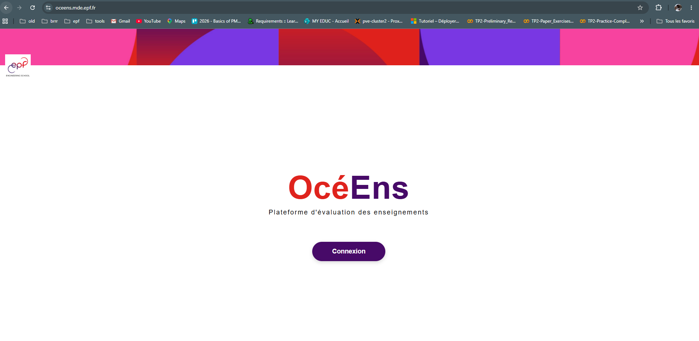
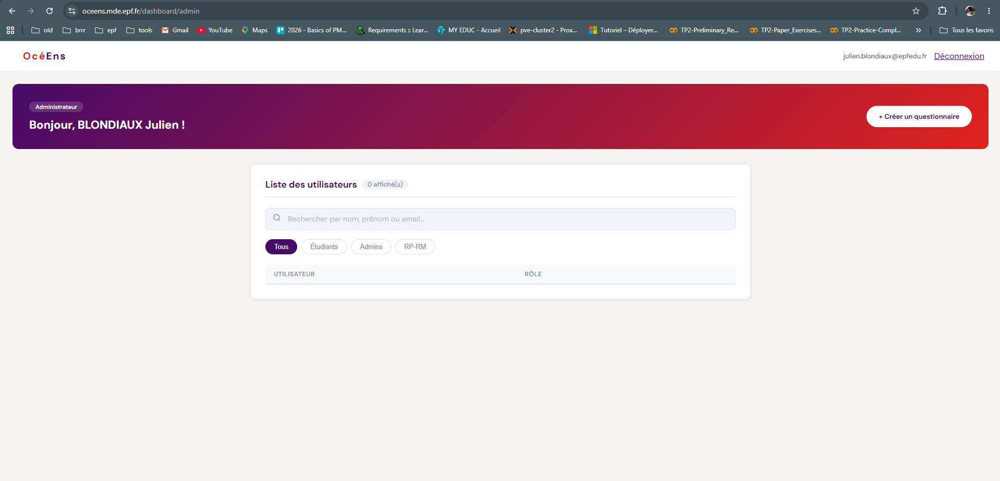
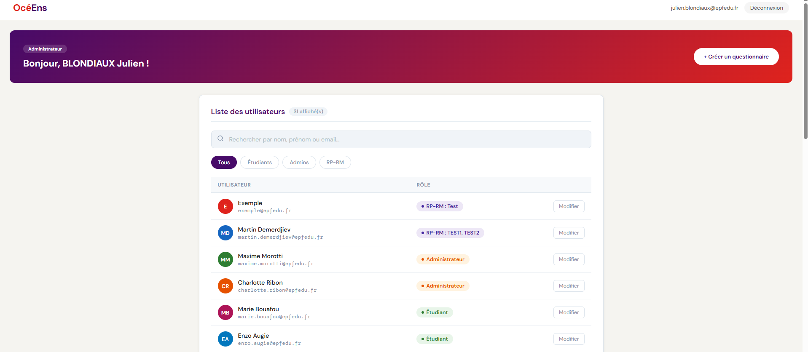
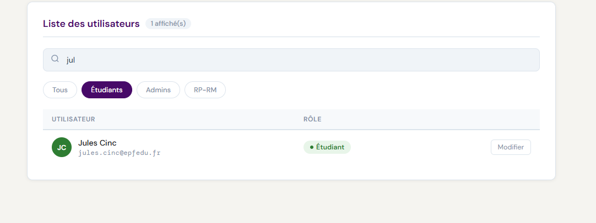
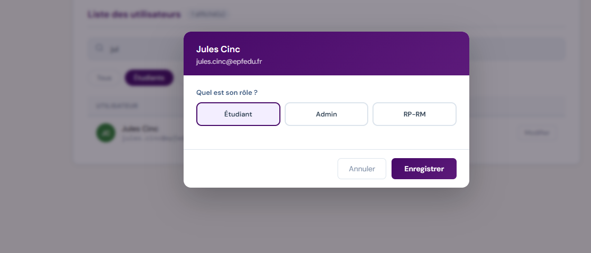
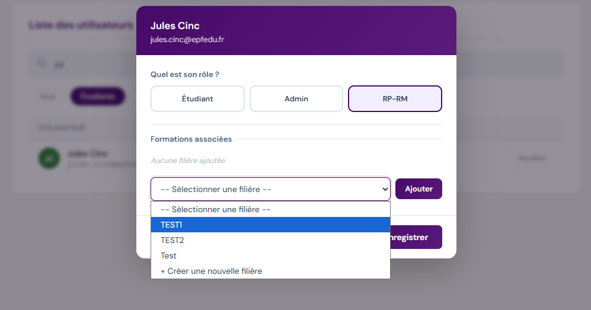

# Documentation Utilisateur — OcéEns II

**Plateforme d'évaluation des enseignements — EPF École d'ingénieurs**

Version du document : 1.0
Date : 15 juin 2026

---

## 1. Introduction et Présentation Générale

### 1.1 Présentation de l'application

**OcéEns** est une application web développée sur mesure pour l'**EPF**. Elle a pour objectif de simplifier la création et de centraliser la collecte des évaluations des enseignements par les étudiants, à la fin de chaque semestre.

Concrètement, l'application permet :

- à la **scolarité et aux responsables pédagogiques (RP-RM)** de créer des sondages d'évaluation paramétrés par campus, filière, semestre et année scolaire ;
- aux **étudiants** de répondre, de façon simple et guidée, à un questionnaire portant sur les Unités d'Enseignement (UE), les modules et les enseignants de leur formation ;
- aux **administrateurs** de gérer les accès et les rôles de chaque utilisateur de la plateforme.

L'application est accessible directement depuis un navigateur web, à l'adresse fournie par l'écçole ( `https://oceens.epf.fr`), et utilise le compte Microsoft professionnel de l'EPF pour l'authentification (Single Sign-On / SSO). Aucune création de compte ni gestion de mot de passe distincte n'est nécessaire. Tout est géré par Microsoft via le protocole OAuth 2.0 + OpenID Connect avec Microsoft Entra ID.

L'interface respecte la charte graphique de l'EPF (logo, couleurs violet/rouge, typographies) afin de garantir une expérience cohérente avec les autres outils numériques de l'école.

### 1.2 Mini-glossaire

| Terme : Définition |
|---|---|
| **Template (modèle de questions)** : La structure de questions réutilisable (sections, questions, options de réponse) sur laquelle se base un sondage. |
| **UE (Unité d'Enseignement)** : Un regroupement de plusieurs modules de cours au sein d'une formation (ex. « UE Mathématiques appliquées »). Une UE peut être marquée comme **optionnelle**. |
| **Module** : Un cours ou un enseignement précis, rattaché à une UE et associé à un ou plusieurs enseignants. |
| **RP-RM** : *Responsable Pédagogique / Responsable de Module*. Rôle attribué aux personnes en charge du suivi pédagogique d'une ou plusieurs filières. Ce rôle peut être associé à une ou plusieurs filières précises (ex. `RP-RM:Ingénieur Informatique;Ingénieur Énergie`). |
| **SSO / Microsoft Entra ID** : Mécanisme de connexion unique : l'utilisateur s'authentifie avec son compte Microsoft professionnel de l'EPF, sans mot de passe propre à OcéEns II. |
| **Statut « Répondu »** : Indicateur attaché à chaque étudiant assigné à un sondage, qui précise s'il a déjà soumis ses réponses (un étudiant ne peut répondre qu'une seule fois par sondage). |

---

## 2. Guide de Prise en Main (Onboarding)

### 2.1 Prérequis techniques

Avant la première utilisation, assurez-vous de disposer des éléments suivants :

- Un **compte Microsoft professionnel de l'EPF** (adresse de type `@epfedu.fr` ou `@epf.fr`), actif et déjà utilisé pour les autres services Microsoft de l'école (Teams, Outlook, etc.).
- Aucune installation logicielle n'est requise : tout fonctionne directement dans le navigateur.

### 2.2 Première connexion et gestion de l'accès

Contrairement à de nombreuses applications, **OcéEns II n'utilise pas de système de mot de passe propre**. La connexion se fait exclusivement via le compte Microsoft de l'établissement (Microsoft Entra ID / Azure AD), ce qui simplifie l'accès et renforce la sécurité.

Voici la procédure pas-à-pas :

1. Ouvrez votre navigateur et rendez-vous sur l'URL de l'application transmise par votre établissement.
2. Sur la page d'accueil, cliquez sur le bouton **« Connexion »**.
3. Vous êtes redirigé vers la page de connexion **Microsoft**. Saisissez votre adresse email professionnelle EPF, puis votre mot de passe Microsoft habituel.
4. Si votre compte est protégé par une **double authentification (MFA)**, validez la demande sur votre application mobile ou saisissez le code reçu, comme pour vos autres connexions Microsoft.
5. Une fois authentifié, vous êtes automatiquement redirigé vers **votre tableau de bord**, dont le contenu dépend de votre rôle (Étudiant, RP-RM ou Administrateur).

**Points importants à connaître :**

- L'accès est restreint aux **adresses email du domaine autorisé de l'EPF**. Toute tentative de connexion avec un compte personnel ou un domaine non reconnu sera refusée.
- Votre **rôle** (Étudiant, RP-RM ou Administrateur) est attribué automatiquement par l'établissement. Si vous estimez que votre rôle est incorrect, contactez l'administration (voir section 6).
- Pour vous déconnecter, cliquez sur **« Déconnexion »** en haut à droite de votre tableau de bord. Vous serez également déconnecté des autres services Microsoft ouverts dans le même navigateur — c'est un comportement normal lié au SSO.
- En cas de premier accès, aucune action supplémentaire n'est nécessaire : votre compte est créé automatiquement dans OcéEns II dès votre première connexion, avec le rôle « Étudiant » par défaut.

---

## 3. Guide d'Utilisation Fonctionnel (Pas-à-pas)

L'application propose trois espaces distincts selon le rôle de l'utilisateur : **Étudiant**, **RP-RM** et **Administrateur**. Cette section détaille le fonctionnement de chacun.

### 3.1 Espace Étudiant — Répondre à un questionnaire d'évaluation

Le tableau de bord Étudiant est volontairement simple : son unique objectif est d'inviter l'étudiant à compléter le ou les questionnaires d'évaluation qui lui sont destinés.

> [Insérer capture d'écran : tableau de bord Étudiant avec la bannière violette/rouge « Bonjour, [Prénom] ! » et le bouton rouge « Compléter le questionnaire »]

**Parcours de l'étudiant :**

1. Après connexion, l'étudiant arrive sur son tableau de bord, qui affiche un message de bienvenue personnalisé et un bouton d'accès au questionnaire en cours.
2. Il clique sur le bouton **« Compléter le questionnaire »**.
3. La page de **questionnaire** s'ouvre. Elle affiche :
   - un **titre** indiquant la formation et le semestre concernés (ex. « Évaluation Ingénieur Informatique — S5 ») ;
   - une succession de **sections** thématiques (UE, modules, enseignants, satisfaction générale, etc.).

> [Insérer capture d'écran : page de questionnaire avec la barre de progression à 35% et une question à choix unique affichée]

4. Pour chaque question, l'étudiant répond selon le type proposé :
   - **Question à choix unique** : sélection d'une seule réponse via un bouton radio (ex. niveaux de satisfaction « Très satisfait », « Plutôt satisfait », « Moyennement satisfait », « Pas du tout satisfait ») ;
   - **Question à choix multiple** : sélection d'une ou plusieurs cases à cocher ;
   - **Question ouverte / commentaire libre** : zone de texte libre pour exprimer un avis détaillé.
5. Pour les **UE optionnelles**, une question préalable demande à l'étudiant s'il a suivi cette UE (« Oui » / « Non »). Si la réponse est « Non », les questions liées à cette UE sont automatiquement masquées et l'étudiant passe à la section suivante.
6. Pour les **modules à choix d'enseignant**, l'étudiant indique d'abord avec quel(s) enseignant(s) il a suivi le module, puis répond aux questions spécifiques à cet enseignant.
7. Une fois toutes les sections complétées, l'étudiant arrive sur la dernière section, généralement une **question de satisfaction générale** (type échelle de recommandation).
8. Il clique sur le bouton **« Envoyer les réponses »**.

> [Insérer capture d'écran : bouton final « Envoyer les réponses » avec la barre de progression à 100%]

9. Un message de confirmation **« Merci pour votre participation ! »** s'affiche, confirmant que les réponses ont bien été enregistrées.

> [Insérer capture d'écran : écran de confirmation « Merci pour votre participation ! »]

**À noter :**

- Le questionnaire **ne peut être soumis qu'une seule fois**. Une fois envoyé, il n'est plus possible de modifier ses réponses (voir section 5 en cas de problème).
- L'étudiant ne peut répondre qu'aux sondages pour lesquels il a été **assigné** par son RP-RM (via l'import de la liste des étudiants, voir section 3.2).

---

### 3.2 Espace RP-RM — Créer et gérer un sondage d'évaluation

 **Note** : Le bouton de visualisation des résultats n'est pas focntionnel à l'heure actuelle.

L'espace RP-RM (Responsable Pédagogique / Responsable de Module) est le cœur opérationnel de l'application : c'est ici que sont créés les sondages d'évaluation diffusés aux étudiants.

#### 3.2.1 Tableau de bord RP-RM

> [Insérer capture d'écran : tableau de bord RP-RM ]

À la connexion, le RP-RM accède à son tableau de bord, qui affiche :

- un bouton **« + Créer un questionnaire »** en haut de la bannière de bienvenue ;
- la liste **« Mes questionnaires »**, recensant tous les sondages déjà créés pour la ou les filières dont le RP-RM est responsable. Chaque ligne affiche la formation, le semestre, le campus et l'année scolaire concernés.

Pour chaque sondage existant, trois actions rapides sont disponibles via les icônes à droite de la ligne :

- **Visualisation** (icône graphique) : ouvre la page de résultats du sondage ;
- **Copier le lien** (icône presse-papier) : copie l'URL du questionnaire dans le presse-papiers, pour la transmettre facilement aux étudiants (par email, Teams, etc.) ;
- **Dupliquer** (icône de duplication) : pré-remplit un nouveau sondage à partir de la configuration de celui-ci (pratique pour reproduire la structure d'une année sur l'autre).

Si aucun sondage n'a encore été créé, un message d'accueil invite le RP-RM à cliquer sur **« + Créer un questionnaire »**.

#### 3.2.2 Créer un nouveau sondage (Paramétrage)

1. Depuis le tableau de bord, cliquez sur **« + Créer un questionnaire »**. Vous arrivez sur la page **« Paramétrage du sondage »**.

> [Insérer capture d'écran : page de paramétrage avec les champs « Modèle de questions », « Semestre », « Année scolaire », « Campus » et « Filière »]

2. Renseignez les informations générales du sondage, en haut de page :
   - **Modèle de questions** : sélectionnez le template de questionnaire à utiliser (chaque template correspond à une structure de questions prédéfinie) ;
   - **Semestre** : choisissez le semestre concerné (S1 à S10) ;
   - **Année scolaire** : sélectionnez l'année scolaire dans la liste, ou cliquez sur le bouton **« + »** à côté du champ pour ajouter une nouvelle année scolaire si elle n'existe pas encore.
3. Sélectionnez ensuite le **Campus** (ex. Paris-Cachan, Montpellier, Troyes, St-Nazaire) puis la **Filière** correspondante. Si la filière n'existe pas encore dans la liste, cliquez sur le bouton **« + »** à côté du champ « Filière » pour en créer une nouvelle (ce bouton n'est actif qu'une fois un campus sélectionné).
4. Une fois le campus et la filière sélectionnés, la section de configuration des **Unités d'Enseignement (UE)** apparaît :
   - Pour chaque UE, indiquez son **nom** et précisez si elle est **optionnelle** (les étudiants pourront alors indiquer s'ils l'ont suivie ou non avant de répondre aux questions associées) ;
   - Au sein de chaque UE, **ajoutez les modules** correspondants (cours) ;
   - Pour chaque module, renseignez le ou les **enseignants** concernés. Si plusieurs enseignants peuvent intervenir sur le même module, vous pouvez activer l'option **« Choix exclusif de l'enseignant »** : l'étudiant devra alors préciser avec quel enseignant il a suivi ce module avant de répondre aux questions le concernant.

> [Insérer capture d'écran : section « UE » dépliée avec un module ajouté, ses enseignants associés et le bouton « Choix exclusif de l'enseignant »]

5. **Astuce — Réutiliser la configuration de l'année précédente** : si un sondage existe déjà pour la même filière et le même semestre lors de l'année scolaire précédente, l'application propose automatiquement de **pré-remplir les UE, modules et enseignants** à partir de cette configuration. Vous pouvez ensuite l'ajuster (ajout, suppression ou modification de modules/enseignants) avant publication.
6. Une fois la configuration terminée, cliquez sur le bouton **« Publier le sondage »** (en bas de page). Le bouton n'est actif que lorsque les champs Campus et Filière sont renseignés.

> [Insérer capture d'écran : bouton « Publier le sondage » activé en bas de la page de paramétrage]

7. Une fois le sondage publié, l'application génère automatiquement :
   - un **identifiant unique de sondage** ;
   - une **URL de questionnaire** dédiée (ex. `/questionnaire/3/12`), à transmettre aux étudiants concernés.

Le nouveau sondage apparaît désormais dans la liste **« Mes questionnaires »** du tableau de bord.

#### 3.2.3 Importer la liste des étudiants concernés

Pour qu'un étudiant puisse répondre à un sondage, il doit être **assigné** à celui-ci. Cette assignation se fait via un **import de fichier Excel (.xlsx)** contenant la liste des adresses email des étudiants concernés.

1. Préparez un fichier **Excel au format .xlsx**, avec une adresse email étudiant par ligne, dans la **première colonne** de la première feuille du classeur (sans ligne d'en-tête obligatoire, mais celle-ci sera simplement ignorée si elle ne contient pas d'adresse email valide).

> [Insérer capture d'écran : exemple de fichier Excel avec une colonne A contenant des adresses email d'étudiants, une par ligne]

2. Depuis l'interface de gestion du sondage (page de paramétrage ou de visualisation), utilisez la fonction **« Importer les étudiants »** et sélectionnez votre fichier `.xlsx`.
3. L'application traite automatiquement le fichier et affiche un résumé de l'import, indiquant :
   - le nombre d'adresses email lues ;
   - le nombre de nouveaux comptes étudiants créés ;
   - le nombre d'étudiants déjà existants dans la base ;
   - le nombre d'étudiants nouvellement assignés au sondage ;
   - le nombre d'étudiants déjà assignés auparavant (non dupliqués).

> [Insérer capture d'écran : message de confirmation d'import affichant le nombre d'emails lus, de comptes créés et d'assignations effectuées]

**À noter :** seuls les étudiants figurant dans cette liste pourront accéder au questionnaire et y répondre. Un import peut être répété pour ajouter de nouveaux étudiants sans dupliquer les assignations existantes.

#### 3.2.4 Visualiser les résultats d'un sondage

Fonctionnalité poas encore implémentée.

---

## 4. Espace Administration

L'espace Administration est réservé aux utilisateurs disposant du rôle **Admin**. Il permet de gérer les accès de l'ensemble des utilisateurs de la plateforme (étudiants, RP-RM, administrateurs).

### 4.1 Consulter et rechercher des utilisateurs

1. Depuis le tableau de bord Admin, la section **« Liste des utilisateurs »** affiche l'ensemble des comptes enregistrés dans l'application, avec pour chacun : son nom/email et son **rôle actuel** (badge coloré « Étudiant », « Admin » ou « RP-RM »).
2. Utilisez la **barre de recherche** en haut du tableau pour retrouver un utilisateur par nom, prénom ou adresse email.
3. Utilisez les **filtres rapides** (« Tous », « Étudiants », « Admins », « RP-RM ») pour n'afficher qu'une catégorie d'utilisateurs. Le compteur en haut à droite de la liste indique le nombre d'utilisateurs actuellement affichés.

### 4.2 Modifier le rôle et les droits d'un utilisateur

1. Cliquez sur la ligne de l'utilisateur concerné, ou sur le bouton **« Modifier »** situé à droite de la ligne. Une fenêtre modale **« Modifier le rôle »** s'ouvre.

2. Sélectionnez le nouveau rôle souhaité parmi les trois options proposées :
   - **Étudiant** : accès au tableau de bord étudiant et aux questionnaires qui lui sont assignés ;
   - **Admin** : accès complet à l'espace d'administration des utilisateurs ;
   - **RP-RM** : accès au tableau de bord RP-RM (création et gestion de sondages).
3. Si vous sélectionnez **RP-RM**, une section supplémentaire **« Types RP-RM »** apparaît. Elle permet d'associer une ou plusieurs **filières** à ce responsable pédagogique :
   - cliquez sur **« Ajouter un type RP-RM »** pour ajouter une nouvelle filière à gérer ;
   - saisissez le nom exact de la filière dans le champ texte (ex. « Ingénieur Informatique ») ;
   - répétez l'opération pour associer plusieurs filières à un même RP-RM si nécessaire ;
   - utilisez le bouton **« ✕ »** sur une carte pour retirer une filière de la liste.

4. Cliquez sur **« Enregistrer »** pour valider la modification, ou sur **« Annuler »** pour fermer la fenêtre sans appliquer de changement.
5. Une **notification de confirmation** (« Rôle mis à jour ») s'affiche brièvement en bas à droite de l'écran pour confirmer la prise en compte de la modification.

**Important :** la modification de rôle prend effet **immédiatement**. Si l'utilisateur concerné est déjà connecté, le changement de rôle (et donc de tableau de bord) sera visible lors de sa prochaine connexion.

---

## 5. Guide de Résolution des Problèmes (FAQ / Troubleshooting)

### 5.1 « Je suis redirigé vers la page de connexion alors que j'étais déjà connecté »

**Cause probable :** votre session a expiré (déconnexion automatique après une période d'inactivité), ou votre navigateur a bloqué les cookies nécessaires à la session.

**Solution :**
1. Cliquez simplement sur **« Connexion »** pour vous reconnecter via votre compte Microsoft EPF — vos identifiants Microsoft étant généralement déjà enregistrés, la reconnexion est immédiate.
2. Si le problème persiste, vérifiez que votre navigateur **autorise les cookies** pour le domaine de l'application (paramètres de confidentialité du navigateur).
3. Évitez d'utiliser la **navigation privée** de manière prolongée, celle-ci pouvant bloquer la persistance de session.

### 5.2 « Accès refusé : domaine non autorisé »

**Cause probable :** vous avez tenté de vous connecter avec une adresse email qui n'appartient pas au domaine officiel de l'EPF (par exemple un compte Microsoft personnel ou un autre compte professionnel).

**Solution :**
1. Déconnectez-vous complètement de votre compte Microsoft (y compris depuis les autres onglets/applications Microsoft ouverts).
2. Reconnectez-vous à OcéEns II en utilisant **votre adresse professionnelle EPF** (format `@epfedu.fr` ou `@epf.fr`).
3. Si vous ne disposez pas (ou plus) d'une telle adresse, contactez le service informatique de l'EPF pour vérifier l'état de votre compte.

### 5.3 « L'import de mon fichier Excel échoue ou n'importe aucun étudiant »

**Cause probable :** le fichier n'est pas au format `.xlsx`, est vide, ou les adresses email ne se trouvent pas dans la première colonne.

**Solution :**
1. Vérifiez que le fichier est bien enregistré au format **Excel (.xlsx)** — les formats `.xls`, `.csv` ou `.ods` ne sont pas acceptés.
2. Vérifiez que les **adresses email des étudiants figurent dans la première colonne (colonne A)** de la première feuille du classeur, une adresse par ligne.
3. Assurez-vous que le fichier n'est **pas vide** et contient au moins une adresse email valide (avec un `@`).
4. Réenregistrez le fichier si besoin (« Enregistrer sous… » → format `.xlsx`) puis réessayez l'import.
5. Si le message d'erreur persiste, notez le message exact affiché et transmettez-le au support technique (voir section 6) avec une copie du fichier concerné.

### 5.4 « Le système m'indique que j'ai déjà soumis mes réponses »

**Cause probable :** vous avez déjà validé et envoyé le questionnaire pour ce sondage. Par mesure d'intégrité des données, **chaque étudiant ne peut répondre qu'une seule fois** par sondage.

**Solution :**
1. Si vous pensez qu'il s'agit d'une erreur (par exemple, vous n'avez jamais ouvert ce questionnaire auparavant), contactez votre RP-RM ou le support technique en précisant la date et l'heure approximative de l'incident.
2. Aucune modification de réponse déjà soumise n'est possible directement depuis l'interface : seule une intervention manuelle en base de données par un administrateur technique peut permettre une nouvelle soumission, à titre exceptionnel.

### 5.5 « Je n'ai pas accès au questionnaire / le lien indique "Sondage introuvable" »

**Cause probable :** soit le lien transmis est incorrect ou obsolète, soit vous n'avez pas été **assigné** à ce sondage par votre RP-RM (votre adresse email ne figure pas dans la liste importée, voir section 3.2.3).

**Solution :**
1. Vérifiez que le lien utilisé correspond bien à celui transmis officiellement par votre établissement (pas un lien copié/collé tronqué).
2. Contactez le RP-RM de votre filière pour confirmer que votre adresse email a bien été incluse dans la liste des étudiants importée pour ce sondage.
3. Si nécessaire, le RP-RM peut effectuer un **nouvel import** incluant votre adresse email (l'import ne duplique pas les assignations déjà existantes, voir section 3.2.3).

### 5.6 « Mon tableau de bord est vide ou n'affiche pas les bonnes informations (rôle RP-RM/Admin) »

**Cause probable :** votre compte a été créé automatiquement avec le rôle par défaut **« Étudiant »**, car votre rôle RP-RM ou Admin n'a pas encore été attribué dans l'application.

**Solution :**
1. Contactez un **administrateur** de la plateforme pour qu'il mette à jour votre rôle depuis l'espace d'administration (voir section 4.2).
2. Une fois le rôle mis à jour, **déconnectez-vous puis reconnectez-vous** : votre tableau de bord sera automatiquement adapté à votre nouveau rôle.

---

*Document rédigé dans le cadre de la livraison du projet OcéEns II. Pour toute question relative à ce document, contactez l'équipe projet.*
